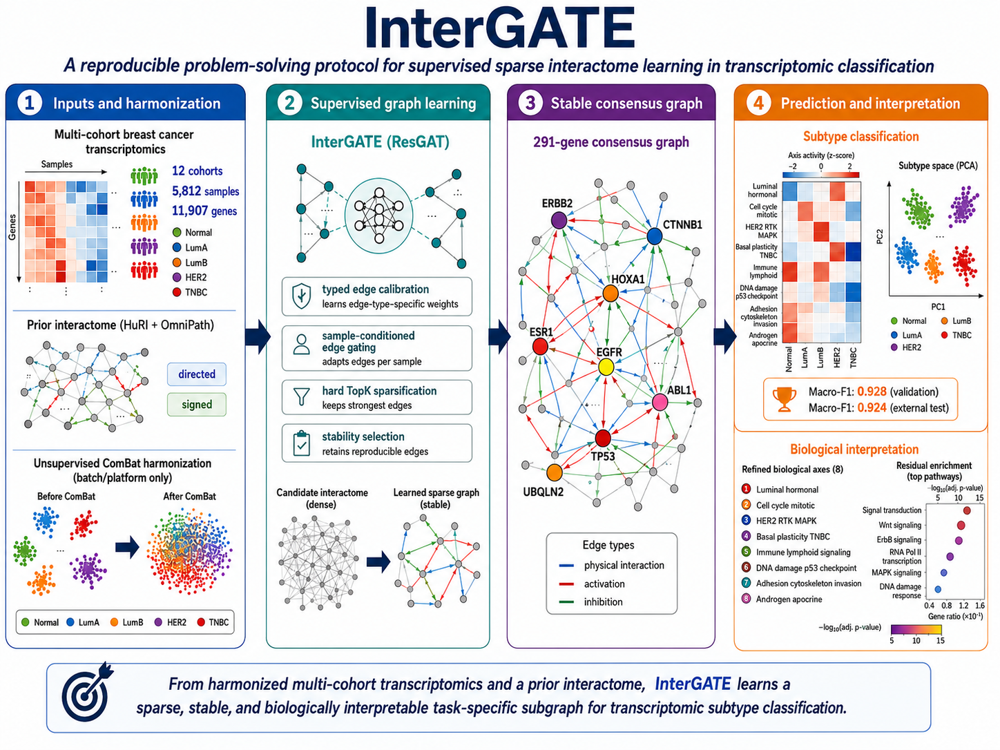

<p align="center">
  
</p>

# InterGATE — supervised sparse interactome learning

[](LICENSE)
[](LICENSE-CC-BY-4.0.md)

InterGATE is a modular graph neural network pipeline for supervised learning of sparse, stable and interpretable task-specific subnetworks from transcriptomic data and prior biological interaction graphs. The repository includes the breast cancer subtype classification case study described in the manuscript.

The data source configured for this package is:

```text
DOI: 10.5281/zenodo.20815745
Zenodo record id: 20815745
```

## Quick start

Create the environment:

```bash
conda env create -f environment.yml
conda activate intergate
pip install -e ".[all]"
```

For non-conda installations:

```bash
python -m venv .venv
source .venv/bin/activate
pip install --upgrade pip
pip install -e ".[all]"
```

Use Python 3.10 or 3.11. The package metadata intentionally excludes Python 3.13 because several scientific and graph-learning dependencies may not yet provide stable wheels for that version.

For GPU runs, install the PyTorch and PyTorch Geometric builds that match your CUDA version before running the notebooks.

Download and arrange the data:

```bash
python scripts/download_zenodo_data.py --extract
python scripts/00_check_setup.py
```

Then run the main notebooks in order:

```text
0_Main_Pipeline.ipynb
1_Results_Bootstrap.ipynb
2_Ejes_REFINED_AXES.ipynb
3_Ejes_Figura_residuales.ipynb
4_Lista_genes_por_eje.ipynb
5_Bioinformatics_Benchmarks.ipynb
6_Benchmarks_SOTA.ipynb
```

Or execute the main workflow from the shell:

```bash
bash scripts/run_notebooks.sh
```

The optional backbone-replacement ablation is provided separately because it can be computationally expensive:

```bash
bash scripts/run_backbone_ablation.sh
# or: make backbones
```

This executes `notebooks/7_Backbone_Ablation.ipynb` and writes results under `artifacts_backbone_ablation/`. The paper-aligned backbone diagnostic supplied with this release is documented in `docs/BACKBONE_ABLATION.md`.

## Required data files

The core pipeline expects:

```text
data/processed/expr_combat_corrected.csv
data/processed/metadata_combined.csv
```

The download script attempts to find these files automatically inside the Zenodo files. If Zenodo stores them under slightly different names, the script searches common alternatives and copies them into the expected layout. If automatic detection fails, manually copy or rename the files to the two paths above.

## Optional external graph resources

The graph builder can use local copies of:

```text
data/external/omnipath_interactions.tsv
data/external/HuRI.tsv
data/external/HuRI.psi
```

If these files are absent, `intergate.graph` can still try to download OmniPath and HuRI resources during graph construction. Keeping local copies is preferable for offline and reproducible reruns.

## Useful commands

```bash
make install     # pip install -e .[all]
make data        # download/extract Zenodo data
make check       # verify required local layout
make smoke       # import package modules and check notebook metadata
make notebooks   # execute main notebooks in order
make backbones   # execute optional backbone-ablation notebook
make clean       # remove Python caches
```

## Backbone ablation and graph controls

The repository contains two distinct graph-comparison layers.

1. `intergate.backbone_ablation` is an internal architecture ablation. It keeps the InterGATE sparse graph-learning protocol active and only swaps the message-passing block used inside `ImprovedSharedGraphGNN`. The implemented drop-in blocks are weighted GraphSAGE, weighted GIN and a local graph-transformer-style block. Use this analysis to test whether the ResGAT backbone is the best choice inside the proposed framework.

2. `intergate.benchmarks` and `intergate.benchmarks_gnn_baselines` are fixed-prior graph controls. In these controls, graph learning is disabled and the biological prior is held fixed. These rows answer a different question: whether ordinary message passing on a fixed prior is sufficient. The fixed-prior GraphSAGE/GIN/GraphTransformer run-level CSVs used for the supplementary backbone-control table are stored under `docs/`.

Do not merge both result families into a single row set without labelling them clearly. Backbone-replacement rows are ablation results; fixed-prior rows are external graph-control baselines.

## Environment variables

All important paths can be overridden without editing code:

```bash
export INTERGATE_DATA_DIR=/path/to/processed_data
export INTERGATE_EXPR_CSV=/path/to/expr_combat_corrected.csv
export INTERGATE_META_CSV=/path/to/metadata_combined.csv
export INTERGATE_RAW_DATA_DIR=/path/to/raw_zenodo_files
export INTERGATE_EXTERNAL_DATA_DIR=/path/to/external_graph_files
export INTERGATE_CACHE_ROOT=/path/to/cache
export INTERGATE_ARTIFACTS_ROOT=/path/to/artifacts_ablation
```

## Validation checklist

Before launching the full workflow, run:

```bash
python scripts/01_smoke_test.py
python scripts/00_check_setup.py
```

The smoke test checks that core package modules import correctly and that notebooks do not contain stored outputs, execution counts, or obvious absolute local paths. The setup check verifies that the required processed CSV files are available.

## Reproducibility notes

The package follows standard computational reproducibility practices: relative paths, explicit environment files, stable data DOI, checksum manifest, notebook execution order and local cache/artifact directories. The file `REFERENCES.bib` includes methodological and software references relevant to FAIR/reproducible workflows, HuRI, OmniPath, PyTorch and PyTorch Geometric.

## Citation

Use the Zenodo DOI for the data:

```text
10.5281/zenodo.20815745
```

A software citation file is provided in `CITATION.cff` and points to the public repository URL.
